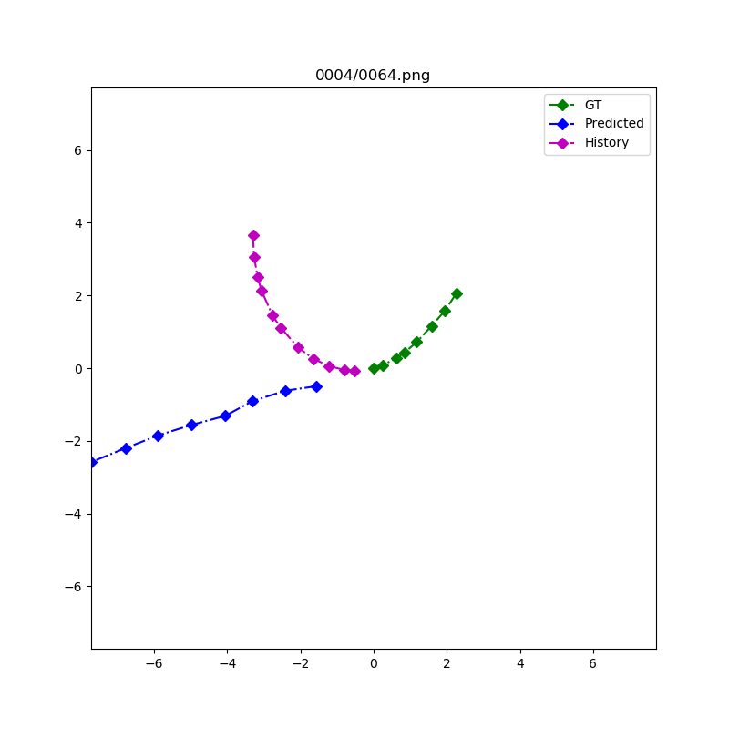

## Novel GAN-based Approach
This is my implementation of the baseline transformer augmented with a critic transformer and trained as a GAN. [This diagram](../report/gen-disc-figure.pdf) shows the architecture which is explained in [the report](../report)


## Backbone Transformer Architecture
This section is to recreate the baseline here and then build off it.

I'm using the [Trajectory-Transformer](github.com/FGiuliari/Trajectory-Transformer.git) repo as the baseline model as described in [my report](../report). Make sure the git submodule is initialized as a subdirectory [here](Trajectory-Transformer) as described in the [main README](../README.md). If not, run the following command
```
git submodule init
git submodule update
```

## Applying the modifications
You need to copy the modified files by running the command (this also copies the modifications in [the baseline](../baseline))
```
# For sequential transformer (first approach)
sh modifications_seq/apply_modifications.sh
# Or for parallel transformer (second approach)
sh modifications_paral/apply_modifications.sh
```

## Training
You can start training by running the following command with arguments explained in [train_gan.py](modifications_seq/train_gan.py)
```
CUDA_VISIBLE_DEVICES=0 python train_gan.py \
    --dataset_folder ../../dataset \
    --dataset_name data \
    --name mygan \
    --obs 12 --preds 8 \
    --val_size 64 \
    --max_epoch 360 \
    --save_step 1 \
    --visual_step 20 \
    --grad_penality 10 \
    --crit_repeats 2 \
    --batch_size 64
```

You can visualize the loss curves live using
```
tensorboard --logdir logs --bind_all
```

You can also visualize the saved generations during training by running
```
cd Trajectory-Transformer
python visual_utils.py \
    --mat_file output/gan/mygan/step_0148.mat \
    --out_dir vis \
    --begin 0 \
    --end -1 \
```
You can convert the sequence of images generated above into a movie using
```
sudo apt install ffmpeg
cd vis
ffmpeg -r 8 -f image2 -s 1080x1080 -i %04d.png -vcodec libx264 -crf 25  -pix_fmt yuv420p vis.mp4
```

Here's a sample


